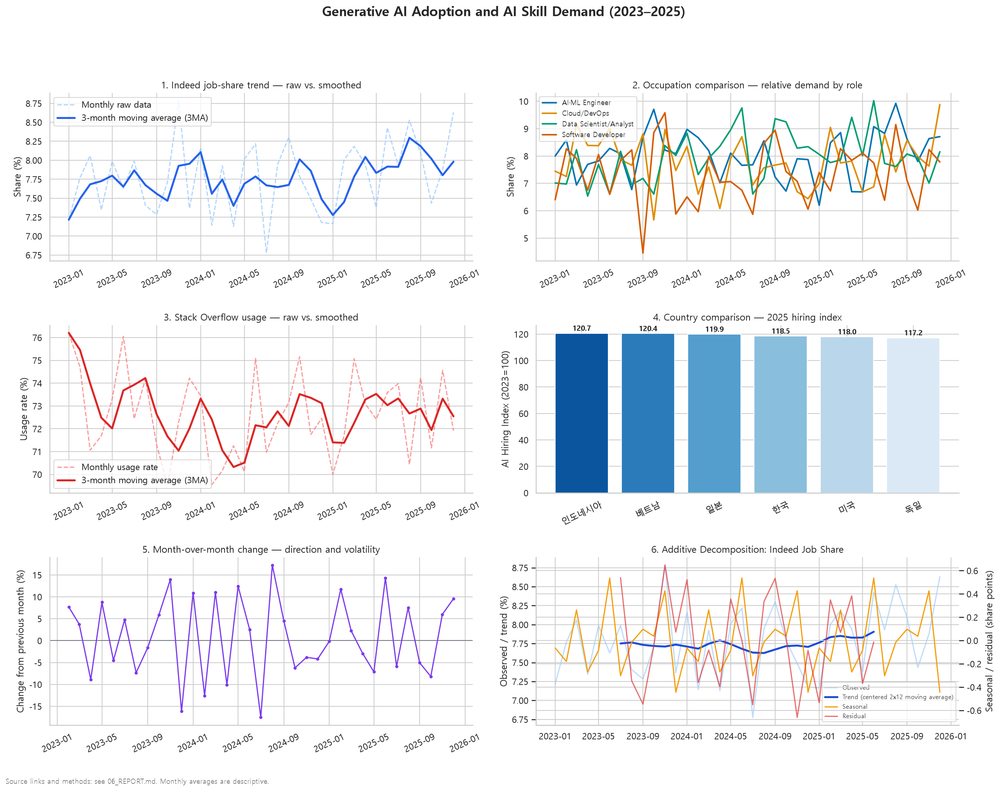

# AI Trend Analysis Report

> 생성 시각: 2026-10-02T05:52:30+09:00
> GitHub: https://github.com/bigpark61/data_trend
> 데이터 원문: [Indeed Hiring Lab](https://www.hiringlab.org/) · [Stack Overflow Survey](https://survey.stackoverflow.co/2024/ai) · [LinkedIn Economic Graph](https://economicgraph.linkedin.com/)
> 데이터 파일: `ai_trend_dataset_template.csv` (864행, 36개월, 2023-01–2025-12)

## 1. 분석 목적과 질문별 지표

| 분석 질문 | 사용 지표와 산식 |
|---|---|
| AI 채용공고 비중은 기간 중 어떻게 달라졌는가? | `source_indeed_ai_job_share`: 월별 산술평균, 전월 대비 변화율 `(현재월/전월-1)×100`, 3개월 후행 이동평균 |
| 개발자의 AI 도구 사용률은 채용 수요와 같은 방향으로 움직였는가? | `source_so_ai_use_rate`와 Indeed 비중의 월별 평균·전월 대비 변화율을 각각 비교 (두 출처의 모집단·측정주기가 다르므로 인과관계로 해석하지 않음) |
| AI 채용 지수는 2025년에 국가별로 어떻게 달랐는가? | `source_linkedin_ai_hiring_index`: 2025년 국가별 산술평균 (지수 기준 2023=100) |

## 2. 처리 단계와 재현 방법

| 단계 | 함수 | 입력 → 출력 |
|---|---|---|
| CSV 로드·검증 | `ai_trend_data.load_dataset` | CSV → 정규화된 컬럼명, 검증된 날짜·키·수치형 DataFrame |
| 월별/직무/국가 집계·파생변수 | `ai_trend_data.prepare_data` | DataFrame → 월별 평균, 3MA, 전월 변화율, 직무/국가 비교, 분해 성분 |
| PNG 대시보드 | `ai_trend_visual.create_ai_trend_dashboard` | CSV → `output/ai_trend_visualization.png` |
| PDF 생성 | `ai_trend_visual.create_analysis_pdf` | CSV → `output/ai_trend_analysis_6pages.pdf` (6페이지) |
| 보고서 생성 | `ai_trend_visual.create_analysis_report` | CSV 및 산출물 경로 → `06_REPORT.md` |
| 웹 API·대시보드 | `app.build_charts`, `GET /api/data`, `templates/index.html` | 동일 공통 집계 → JSON → Chart.js |

재생성: `python ai_trend_visual.py` (프로젝트 가상환경을 활성화한 경우). 그래프의 목적은 순서대로 추세 완화 비교, 직무 간 비교, 개발자 사용률 추세, 국가 간 비교, 전월 변화 방향·변동성, 추세·계절성·잔차의 분리입니다.

## 3. 원본 CSV 샘플

아래는 원본에서 추출한 첫 10행 중 날짜와 핵심 지표입니다. 전체 레코드는 **864행**입니다.

```text
year_month  source_indeed_ai_job_share  source_so_ai_use_rate  source_linkedin_ai_hiring_index
    Jan-23                        9.22                   81.9                            110.4
    Jan-23                        6.77                   74.3                            128.1
    Jan-23                        6.92                   64.3                            108.3
    Jan-23                        7.00                   82.6                            123.1
    Jan-23                        7.42                   80.8                            101.3
    Jan-23                        6.35                   82.9                            106.4
    Jan-23                        3.72                   61.3                            113.7
    Jan-23                       10.22                   73.4                            103.6
    Jan-23                        7.03                   80.7                            127.5
    Jan-23                       10.99                   71.2                            111.3
```

## 4. 시계열 결과와 집계 민감도

| 분석 | 결과 |
|---|---|
| Indeed 시작월 → 종료월 | 7.216% → 8.632% (+1.416%p, 상대 변화 +19.62%) |
| 전체 월별 관측치의 2.5–97.5 백분위 | 7.083%–8.651% (관측 구간이며 신뢰구간이 아님) |
| 전반 18개월 평균 (2023-01–2024-06) | 7.729% |
| 후반 18개월 평균 (2024-07–2025-12) | 7.837% (전반 대비 +1.40%) |

### 대체 집계 단위: 분기 평균

월별 평균 36개를 분기별 산술평균으로 다시 묶었습니다. 월별 자료의 단기 변동은 감춰지므로 분기 집계는 장기 수준 비교에만 사용합니다.

| 분기 시작월 | Indeed AI job share 평균 (%) |
|---|---:|
| 2023-01 | 7.682 |
| 2023-04 | 7.652 |
| 2023-07 | 7.559 |
| 2023-10 | 7.953 |
| 2024-01 | 7.746 |
| 2024-04 | 7.786 |
| 2024-07 | 7.674 |
| 2024-10 | 7.485 |
| 2025-01 | 7.783 |
| 2025-04 | 7.916 |
| 2025-07 | 8.185 |
| 2025-10 | 7.981 |

### 기간 선택 반례: 연도별 평균

시작·종료월 비교는 일부 월의 영향을 받습니다. 연도별 평균으로 바꾸면 아래와 같아, 동일한 상승 방향이더라도 기간·집계 선택에 따라 크기가 달라집니다.

| 연도 | 월별 값의 연평균 (%) |
|---|---:|
| 2023 | 7.711 |
| 2024 | 7.673 |
| 2025 | 7.966 |

## 5. 결측·이상치 규정

- `year_month`의 `%b-%y` 파싱 실패, 국가/직무 키 결측·빈 값, 날짜·국가·직무 조합 중복, 숫자 칼럼의 비결측 문자열은 분석을 중단하고 오류를 냅니다. 줄바꿈·공백이 포함된 CSV 헤더는 공백 제거 후 매핑합니다.
- 수치 지표의 결측은 대체하거나 행 삭제하지 않습니다. 월별 평균은 존재하는 관측치로 계산하고, 해당 월의 모든 값이 결측이면 결과도 결측으로 유지합니다. 연속 3개월 이동평균은 결측을 메우지 않으며 유효값이 1개 이상인 창에서만 계산합니다.
- 이상치는 각 수치 칼럼 전체에서 Tukey 기준 `Q1−1.5×IQR` 미만 또는 `Q3+1.5×IQR` 초과로 **표시만** 합니다. 원값을 제거·대체하지 않습니다. 이 기준은 오류 판정이 아니라 검토 신호이며, 분포 꼬리의 실제 관측치일 수 있습니다.

| 수치 칼럼 | 결측 행 | IQR 표시 행 | 표시 기준 하한–상한 |
|---|---:|---:|---:|
| `source_indeed_total_it_index` | 0 | 0 | 80.000–112.000 |
| `source_indeed_ai_job_share` | 0 | 0 | -0.551–16.239 |
| `source_so_ai_use_rate` | 0 | 0 | 47.600–98.000 |
| `source_so_avg_salary_usd` | 0 | 0 | -1233.500–173078.500 |
| `source_linkedin_ai_hiring_index` | 0 | 0 | 81.837–157.938 |
| `source_stanford_genai_demand_score` | 0 | 0 | 27.713–116.412 |

검사 결과: 수치 지표 전체 결측 **0건**, IQR 표시 **0건**. 어떤 값도 결측 대체나 이상치 제거로 바꾸지 않았습니다.

## 6. 시각화 산출물



**그림 1.** 6패널 PNG 대시보드 (`output/ai_trend_visualization.png`), 2655×2102픽셀, 150 dpi. 패널은 추세/평활 비교, 직무 비교, 사용자 추세, 국가 비교, 전월 변화율, Indeed 가법 분해를 보여줍니다.

**부록 PDF:** [`output/ai_trend_analysis_6pages.pdf`](output/ai_trend_analysis_6pages.pdf), US Letter 가로형(11×8.5인치) 기준 6페이지: Indeed 추세, 직무 비교, Stack Overflow 사용률, 2025 국가 비교, 전월 변화율, 가법 분해.

## 7. 해석, 불확실성 및 한계

- 변화율은 월별 집계값의 단순 전월 대비 비율입니다. 분모가 작을 때 크게 흔들리고 기준월의 영향을 받습니다. 첫 달은 이전 월이 없어 정의되지 않습니다.
- 3MA는 후행 평활값으로 급격한 전환을 늦게 반영하고 시작 구간은 1–2개 관측치만으로 계산됩니다. 계절분해는 12개월 이동평균 두 개를 중심 정렬한 2×12 이동평균을 추세로 한 가법 분해이며 양 끝 6개월의 추세·잔차가 계산되지 않습니다. 36개월의 짧은 기간에서 계절 성분을 확정적 반복 주기로 일반화하지 않습니다.
- 월별 값은 기술통계이며 확률 표본 설계나 독립 관측 가정이 확인되지 않았습니다. 따라서 p-value와 모집단 신뢰구간을 계산하지 않았습니다. 2.5–97.5 백분위는 관측값 분포 요약일 뿐 불확실성 구간이 아닙니다.
- Stack Overflow 설문과 채용공고·LinkedIn 지수는 모집단, 수집 방식, 분모가 서로 다르고 표본 편향이 있을 수 있습니다. 동행은 인과를 뜻하지 않습니다. 비교 가능한 출처 정의·관측 시점 확인과 교차 검증이 필요합니다.

## 8. 권장 후속 액션과 KPI

AI 직무 수요가 높은 직군을 대상으로 8주 교육 파일럿을 제안합니다. **제안 KPI(관측된 결과가 아닌 목표):** 등록자의 80% 이상 수료, 사전 대비 사후 실무 평가점수 평균 10% 이상 향상. 수료율은 수료자/등록자로, 역량 변화는 동일 문항 사전·사후 평가의 개인별 점수 변화로 측정합니다. 한 개 파일럿에서 인과 효과가 입증됐다고 주장하지 말고 비교군·후속 채용 지표를 별도 수집합니다.

교차검증 후보: [U.S. Bureau of Labor Statistics Employment data](https://www.bls.gov/data/) 및 [Stanford AI Index](https://aiindex.stanford.edu/report/). 지표 정의·국가·기간의 호환성을 먼저 확인해야 하며 직접 합산하지 않습니다.

## 9. 출처 및 AI 사용 기록

| 출처 | 원문 |
|---|---|
| GitHub 저장소 | https://github.com/bigpark61/data_trend |
| Indeed Hiring Lab | https://www.hiringlab.org/ |
| Stack Overflow Developer Survey – AI | https://survey.stackoverflow.co/2024/ai |
| LinkedIn Economic Graph | https://economicgraph.linkedin.com/ |
| Stanford AI Index | https://aiindex.stanford.edu/report/ |

CSV에는 출처별 월별 값이 결합되어 있지만 원자료 추출 쿼리, 원문 파일/행과 각 값의 대응표는 저장소에 없습니다. 위 링크는 원문 출처 안내이며, 현 CSV의 각 행이 해당 사이트에서 직접 내려받은 관측치임을 증명하지 않습니다. 데이터 계보를 완전히 재현하려면 원자료 URL·추출일·변환 내역을 별도 보존해야 합니다.

AI 사용 로그: 기존 평가 전의 프롬프트·응답 전문과 타임스탬프는 저장소에 없어 복원할 수 없습니다. 이번 요청의 기록된 프롬프트는 “위 평가결과를 반영하여 프로그램을 보완해줘”이며, 정확한 대화 시각은 이 생성 스크립트에 제공되지 않았습니다. 이번 보완 응답 요약: CSV 입력 검증과 공통 집계를 추가하고, 월별 변화율·가법 계절분해·분기/기간 비교 및 차트/보고서 산출물을 구현했습니다. 이 요약은 원문 대화 로그가 아닙니다. 이 보고서의 생성 시각은 위에 별도로 기록됩니다. 검증은 `python -m unittest test_ai_trend_data.py` 및 `python ai_trend_visual.py`로 재현할 수 있고, 실행 결과는 저장된 실제 파일을 확인해야 합니다.
